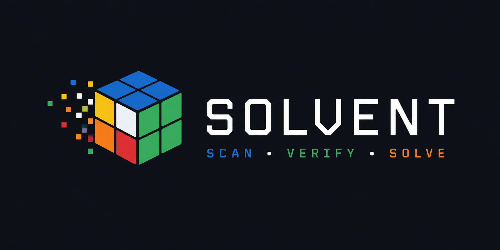

<p align="center">
  
</p>

# Solvent

**Solvent is a precise 2×2 Rubik's cube solver you run in the browser.** Scan a
physical cube with your phone camera, correct any misread stickers, and get an
animated, step-by-step 3D solution you can page through.

- **Live:** https://ryakel.github.io/solvent/
- Pure static site — hosted on GitHub Pages, no backend, no build step to run.
- Ships solving **2×2**, architected so a **3×3** slots in as a module, not a rewrite.
- The solver is **deterministic and unit-tested** against thousands of random
  scrambles, each verified to actually return the cube to solved. Zero tolerance
  for failures.

---

## The flow

**Scan → Verify → Solve.**

1. **Scan.** Point the camera at one face at a time. A reticle overlays an N×N
   grid; capture samples the average color of each sticker region and classifies
   it to the nearest scheme color. No camera? The app falls back cleanly to
   manual color entry and the rest of the flow is identical.
2. **Verify.** Every scanned face shows as an editable grid — tap a sticker, pick
   a color, fix any misread. This step is mandatory. Before solving, Solvent
   validates that the stickers form a *physically real* cube (correct color
   counts, every corner a real piece, no duplicate pieces, solvable orientation)
   and explains exactly what's wrong if not. An impossible cube is never solved.
3. **Solve.** The solution appears as a move list and an animated 3D cube. Step
   forward and back through each turn with a plain-language hint ("R — right face
   clockwise"); drag to rotate the cube. Already-solved cubes are handled
   gracefully. With `prefers-reduced-motion`, turns snap instead of animating.

## Correctness

Correctness is the whole point, so nothing here is trusted — it's proven:

- **A geometric oracle is ground truth.** `src/core/geometry.js` models the cube
  as eight corner cubies with real 3D positions and sticker normals, and turns
  faces by literally rotating a layer 90°. It is manifestly a real cube.
- **The fast solver algebra is derived from and cross-checked against it.** The
  compact move tables in `src/core/cube2.js` are extracted from the oracle, and a
  test asserts the fast apply agrees with full geometry over **5,000 random move
  sequences**. Corner orientation is defined so it is *additive* under every turn.
- **The solver is optimal.** An IDA\* search over the three faces `U, R, F` (after
  normalizing a whole-cube rotation to fix a reference corner) guided by two
  admissible pattern databases finds optimal solutions in single-digit
  milliseconds. **3,000 random scrambles** are solved and each solution is applied
  back and asserted to solve, with max length ≤ 11 (God's number for 2×2).
- **Scan ↔ state round-trips.** Random states → face colors → derived state is the
  identity over **5,000 cases**, which is how geometry/orientation bugs are caught.
- **The real site is tested end-to-end.** A headless Playwright run serves the
  built site under a `/solvent/` subpath, enters a known scramble via the manual
  palette, solves, steps to a solved cube, and confirms an impossible cube is
  rejected — with **no console errors**.

Run it all:

```bash
npm install        # dev dependency: playwright (for the e2e test only)
npm test           # everything: core + solver + facelet + e2e
npm run test:unit  # just the deterministic core/solver tests (no browser)
npm run test:e2e   # just the headless browser test
```

## Run it locally

No build step. Serve the folder over HTTP (the camera API needs a secure context
— `localhost` counts, as does the deployed HTTPS site):

```bash
npm run serve                 # http://localhost:8080/
# or mimic GitHub Pages' project subpath:
node scripts/serve.mjs 8080 /solvent   # http://localhost:8080/solvent/
```

Then open the URL. Any static server works; `scripts/serve.mjs` is a
zero-dependency one included for convenience.

### Camera & HTTPS

`getUserMedia` only works in a **secure context**. That means the deployed Pages
site (HTTPS) and `http://localhost` — but *not* a plain `http://` LAN address. If
the camera is unavailable or denied, use **Enter colors by hand**; the solver is
identical either way.

## Architecture for multiple cube sizes

The UI is **size-agnostic**. It asks the registry for the active
[`SizeModule`](./src/sizes/) and drives whatever it gets back — the scan grid, the
N×N×N renderer, the validator, and the solver are all parameterized.

A `SizeModule` (see `src/sizes/size2x2.js`) exposes:

| field | purpose |
| --- | --- |
| `gridN` | stickers per face edge — the scanner samples a `gridN × gridN` grid |
| `cubiesPerEdge` | the 3D renderer builds a `cubiesPerEdge³` cube |
| `faceOrder`, `colors`, `colorHex`, `colorNames` | scheme + palette |
| `solvedFaces`, `emptyFaces()` | facelet scaffolding |
| `validate(faces)` | returns `{ ok, errors }` with specific messages |
| `classifyColor(rgb)` | nearest-scheme-color for camera samples |
| `moveToTurn(name)` | maps a move to the geometric turn the renderer animates |
| `solve(faces)` | returns `{ moves, frames }` for the move list + animation |

### Adding a 3×3

1. Write `src/sizes/size3x3.js` exporting a module with the same shape
   (`gridN: 3`, `cubiesPerEdge: 3`, a 3×3 facelet/state model, and a `solve`).
2. Register it in `src/sizes/index.js` (there's a `// 3x3: implement SizeModule
   here` marker and the array to add it to).

That's it — the scan → verify → solve → animate flow, the camera scanner, the 3D
renderer, and the UI all work unchanged. The `3×3` chip in the header is already
present and disabled, marking the seam.

## Design

Solvent is meant to read as a precise engineering instrument: a dark slate base
(`#12151A`), technical monospace type, and the six cube colors used only as
restrained accents — with the animated cube as the signature element. The full
brand spec (marks, palette, dissolve motif, do/don't) lives in
[`DESIGN.md`](./DESIGN.md), and the CSS custom properties mirror those exact
palette values.

## Notes on dependencies

- **Three.js (r160) is vendored** into `vendor/three.module.js` and imported by
  relative path rather than hot-linked from a CDN. This keeps the site fully
  self-contained: no external runtime calls, deterministic offline/Pages behavior,
  and reproducible test runs. It is still a pinned, single static file.
- The only npm dependency is **Playwright**, used solely by the end-to-end test.
  The app itself ships zero runtime npm dependencies.
- All asset paths are **relative**, so the site works correctly served from a
  project subpath (`https://<user>.github.io/solvent/`).

## License

[MIT](./LICENSE).
